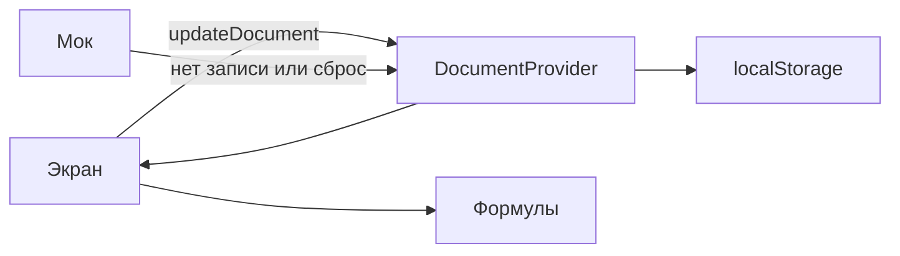

# Архитектура прототипа

Фронтенд финансового и товарного учёта мясного производства. Бэкенда нет: сервер Next отдаёт оболочку, учётные числа на сервер не уходят.

## Слои

| Слой      | Папка          | Что делает                                                           |
| --------- | -------------- | -------------------------------------------------------------------- |
| Предметка | `src/domain`   | Типы, разбор единиц, чистые формулы. Без React и без `localStorage`. |
| Данные    | `src/data`     | Мок, чтение и запись браузера, React-стор.                           |
| Экраны    | `src/features` | Ввод и показ. Считают через функции из `src/domain`.                 |
| Маршруты  | `src/app`      | Собирают экран. Интерактив живёт в `features`.                       |

Зависимости идут в одну сторону: `app` → `features` → `data` и `domain`. `domain` никого не импортирует, кроме своих модулей. `data` импортирует `domain`.

## Поток данных

1. Первый рендер всегда показывает мок. Так серверный HTML совпадает с гидрацией.
2. `useLayoutEffect` в сторе читает `localStorage` до отрисовки и подменяет документ, если запись валидна. Отключение `react-hooks/set-state-in-effect` на этом вызове намеренное: чтение хранилища прямо в рендере расходится с серверным HTML, а эффект после отрисовки на миг показывает мок.
3. Правка вызывает `updateDocument`. Стор пишет весь документ в `localStorage`.
4. Экран заново вызывает формулу. Производные числа в документ не сохраняются.
5. «Вернуть мок-данные» стирает ключ и кладёт в память копию мока.

Ключ собирается как `food-proto:document:v${SCHEMA_VERSION}`. Сейчас это версия 16: цеха, склады, мок одного гамбургера, план сентября 2026 на 20 000 шт, поставки сырья от 1 сентября под этот план, пустой журнал списаний и факт производства с 1 по 15 сентября примерно на половину этого плана. Сырьё с минимумом и максимумом из книги, товары со ставкой НДС, производные и рецепты на 100 кг готового продукта. Мок складов — №1–№4. Старые записи отбрасываются, на экран приходит мок. Чужой или устаревший JSON не чинится молча. Гвард собирает документ только из известных полей.

## Единицы

Предметные единицы и тождества — в `docs/domain.md`. Общие правила хранения:

- Деньги — целые копейки. Рубли появляются только на границе ввода, через `src/domain/units.ts`.
- Готовая продукция — штуки. Сырьё с единицей «кг» — целые граммы. Другую единицу измерения в граммы не переводить.
- Формула умножает целые через `BigInt` и округляет половину вверх до копейки на результате строки, а не на промежуточной цене за штуку.

Себестоимость производной и конечного товара считается в `src/domain/cost.ts` и в документ не пишется. Сумма поставки, потенциальный убыток списания и остаток считаются в `src/domain/stock.ts` и тоже не пишутся. Строка плана продаж — цена с НДС и объём; выручка, себестоимость объёма, Т-проток и рентабельность считаются в `src/domain/sales-plan.ts`. План выпуска и план расхода месяца считаются в `src/domain/production-plan.ts` из плана продаж и рецептов и в документ не пишутся. Факт производства хранит день, выпуск и ручные количества ингредиентов; норма, себестоимость и сравнение с планом считаются в `src/domain/production-fact.ts` и в документ не пишутся. Тестовую строку `probe` не возвращать.

## Удаление

Учётная запись не вырезается из массива. Удаление записывает `deletedAt` строкой ISO (`Date.toISOString()`). `null` значит, что запись в работе. Рабочий список берёт записи без `deletedAt`, удалённые — с меткой. Возврат снова ставит `deletedAt` в `null`. Так у цехов, складов, сырья, производных, рецептурных карт, поставок, списаний, планов продаж и факта производства. На одну дату — одна рабочая запись факта.

Ссылка хранит `id` и после удаления не переписывается. У товара и производной один цех. У сырья, производной и товара один склад. Строка состава — часть карты, строка поставки и строка списания — часть своего документа: убрать строку значит поправить состав, а не завести у строки своё `deletedAt`.

`resetToMock()` стирает ключ браузера и подставляет мок целиком. Это не способ удалить одну запись.

## Чего не делать

- Не добавлять Route Handler, Server Action и `fetch` ради учётных данных.
- Не считать одну и ту же сумму в компоненте и в `domain`.
- Не читать `localStorage` из экрана.
- Не записывать в документ то, что можно получить функцией из других полей.
- Не добавлять блоки за списком «что не делаем сейчас» в `docs/domain.md`.
- Не вырезать учётную запись из массива. Удаление — только `deletedAt`.
