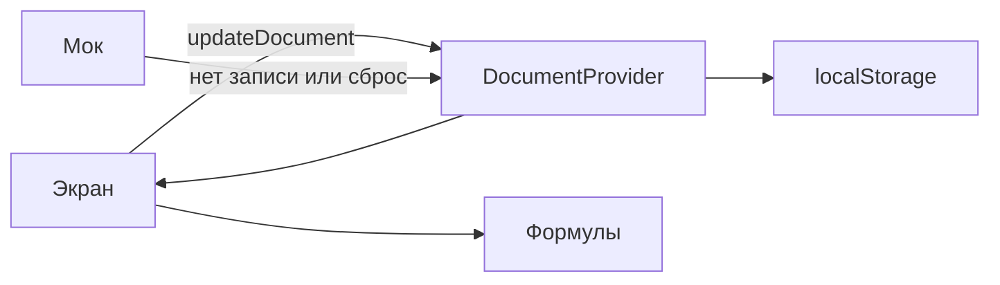

# Архитектура прототипа

Фронтенд финансового и товарного учёта мясного производства. Бэкенда нет: сервер Next отдаёт оболочку, учётные числа на сервер не уходят.

## Слои

| Слой      | Папка          | Что делает                                                           |
| --------- | -------------- | -------------------------------------------------------------------- |
| Предметка | `src/domain`   | Типы, разбор единиц, чистые формулы. Без React и без `localStorage`. |
| Данные    | `src/data`     | Мок, чтение и запись браузера, React-стор.                           |
| Экраны    | `src/features` | Ввод и показ. Считают через функции из `src/domain`.                 |
| Маршруты  | `src/app`      | Собирают экран. Интерактив живёт в `features`.                       |

Зависимости идут в одну сторону: `app` → `features` → `data` и `domain`. `domain` никого не импортирует, кроме своих модулей. `data` импортирует `domain`.

## Поток данных

1. Первый рендер всегда показывает мок. Так серверный HTML совпадает с гидрацией.
2. `useLayoutEffect` в сторе читает `localStorage` до отрисовки и подменяет документ, если ключ есть. Форму JSON не проверяем: пишет только это приложение. Отключение правила про `setState` в эффекте на этом вызове намеренное: чтение хранилища прямо в рендере расходится с серверным HTML, а эффект после отрисовки на миг показывает мок.
3. Правка вызывает `updateDocument`. Стор пишет весь документ в `localStorage`.
4. Экран заново вызывает формулу. Производные числа в документ не сохраняются.
5. «Вернуть мок-данные» стирает ключ и кладёт в память копию мока.

Ключ собирается как `food-proto:document:v${SCHEMA_VERSION}`. Сейчас это версия 34: категории ассортимента — записи с мягким удалением (`deletedAt`), конечные товары с НДС, себестоимостью 1 шт с НДС и ссылкой на категорию. Планы продаж и планы производства — массивы с `deletedAt`. Продажа без `deletedAt`: удаление вырезает запись из `sales`. Мок: шесть групп ритейла, Цезарь с курицей и Оливье в «Салаты», гуляш из курицы с рисом в «Горячие блюда», гамбургер в «Роллы и сэндвичи». У всех четырёх НДС 20% и заполнена себестоимость 1 шт с НДС (гамбургер 39,30 ₽). План продаж и план производства сентября 2026 на эти четыре товара, пустой журнал продаж и пустые операционные расходы месяцев. Сырья, производных, рецептов, складов, поставок, списаний, цехов, факта выпуска, остатков и отдельного факта себестоимости в документе нет. Старый ключ другой версии схемы не читается — на экран приходит мок. Битый JSON (не разбирается) тоже даёт мок.

## Единицы

Предметные единицы и тождества — в `docs/domain.md`. Общие правила хранения:

- Деньги — целые копейки. Рубли появляются только на границе ввода, через `src/domain/units.ts`.
- Готовая продукция — штуки.
- Формула умножает целые через `BigInt` и округляет в `src/domain/money.ts` (половина от нуля) на результате строки, а не на промежуточной цене за штуку.

Себестоимость 1 шт читается в `src/domain/cost.ts` из поля товара `unitCostWithVat`; без НДС считается и в документ не пишется, а вводят её в «Планируемом производстве» — обратно в с НДС через `costWithVat`. В «Планировании» клетку «Себест» только показывают. Строка плана продаж — цена с НДС и объём; ввод цены без НДС в «Планировании» пересчитывается в с НДС через `priceWithVatFromExVat`. Выручка, себестоимость объёма, Т-проток и рентабельность считаются в `src/domain/sales-plan.ts`. Строка плана производства — только объём выпуска; себестоимость объёма = себестоимость единицы × объём, считается в `src/domain/production-plan.ts` (`productionPlanForMonth`, `productionPlanMonthView`). Продажа хранит заказчика, дату и строки (товар, штуки, сумму с НДС). Форма продажи — сетка по категориям (`sale-form-table.tsx`): цена штуки считается из суммы и штук (`saleLinePriceWithVat`) и обратно в сумму (`saleLineAmountWithVat`); в документ не пишется. Объём, выручка и цена факта считаются в `src/domain/sales-fact.ts` из журнала продаж и в документ не пишутся. Сводка месяца собирает план и сумму дней факта в `src/domain/summary.ts` и тоже в документ не пишется. Интервал месяцев прогноза складывает полные месяцы через `rangeSummary`. Экран «Планирование» показывает тот же план без линзы (`monthSummary`). Режим фактическая/прогноз (`summaryForLens`): прогноз одного месяца растягивает объём факта, интервал прогноза линзу не применяет. Фактическая смотрит период, в который входит текущий месяц (`actualRangeSummary`): по каждому месяцу урезает объём плана и складывает месяцы. Операционные расходы не трогает. По умолчанию открыт прогноз. Верхний блок свода (выручка, Т-проток, прибыль) считается там же; в документ пишутся только операционные расходы месяца без НДС. План этих расходов вводят в «Планировании», факт — на «Сводке» при одном месяце. План продаж на месяц читается через `salesPlanForMonth`: нет рабочей записи — виртуальный нулевой план, запись появляется при первой правке. План производства — через `productionPlanForMonth` с тем же правилом. Тестовую строку `probe` не возвращать.

## Удаление

Категории, товары, планы продаж и планы производства не вырезаются из массива. Удаление записывает `deletedAt` строкой ISO (`Date.toISOString()`). `null` значит, что запись в работе. Рабочий список берёт записи без `deletedAt`, удалённые — с меткой. Возврат снова ставит `deletedAt` в `null`.

Продажа — исключение: `deleteSale` вырезает запись из `sales`. Поля `deletedAt` у продажи нет, вернуть нельзя, экрана удалённых продаж нет.

Сетка месяца (планирование, сводка, факт, план производства, форма продажи) берёт рабочие товары и удалённые, у которых в этом месяце есть строка рабочего плана продаж, плана производства или продажа. Удалённая категория видна, пока в сетке есть её товары. Суммы периода (выручка, себестоимость, Т-проток, прибыль) включают эти строки: удаление цифры не уменьшает. Набор строк — `periodGridProducts` / `periodGridCategories` в `src/domain/period-grid.ts`, не только `activeProducts`. Удаление категории ставит `deletedAt` ей и всем её рабочим товарам. Возврат категории снимает метку с неё и с её товаров, если имя товара свободно. Строка плана или продажи с id удалённого товара в документе остаётся.

Ссылка хранит `id` и после удаления не переписывается.

`resetToMock()` стирает ключ браузера и подставляет мок целиком. Это не способ удалить одну запись.

## Чего не делать

- Не добавлять Route Handler, Server Action и `fetch` ради учётных данных.
- Не считать одну и ту же сумму в компоненте и в `domain`.
- Не читать `localStorage` из экрана.
- Не записывать в документ то, что можно получить функцией из других полей.
- Не добавлять блоки за списком «что не делаем сейчас» в `docs/domain.md`.
- Не вырезать из массива категорию, товар или план. Для них удаление — только `deletedAt`. Продажу вырезать через `deleteSale`.
